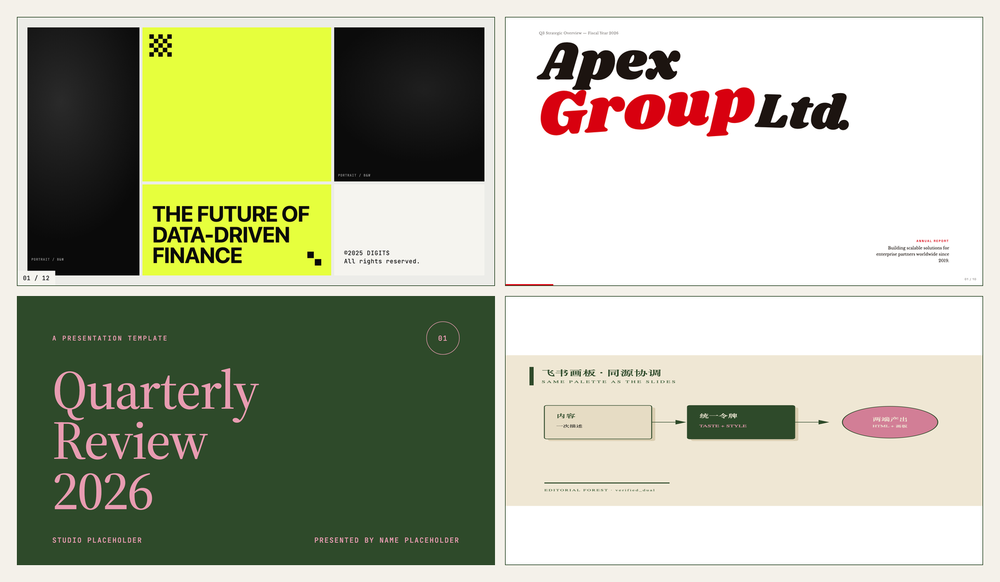

<div align="center">

# sota-present

**Turn one content description into polished HTML slide decks and Feishu whiteboards — with coordinated aesthetics and built-in taste.**

A [Claude Code](https://docs.claude.com/en/docs/claude-code) Skill for state-of-the-art presentations.

English · [简体中文](./README.zh-CN.md)



<sub>Three HTML slide styles + one Feishu whiteboard. Note the bottom row: the green slide cover and the whiteboard share one palette — that is `dual` mode.</sub>

</div>

---

## What it is

`sota-present` is a Claude Code Skill. You describe your content once, and Claude produces presentation material along **two paths**:

- 🎞️ **HTML slide decks** — single self-contained file, zero dependencies, fixed 1920×1080 stage with keyboard / touch / wheel navigation.
- 🖼️ **Feishu (Lark) whiteboard SVGs** — compliant with Feishu's strict renderer, rendered as *editable* whiteboard objects, ready to drop into a Feishu doc.

Pick `dual` and you get both from the same content, sharing one palette so they look like a family.

## Why use it

Most "ask an AI to make slides" attempts produce the same tell-tale slop: indigo accents, Inter everywhere, centered card grids, purple gradients, em-dashes. `sota-present` exists to fix three problems at once:

| Problem | How `sota-present` solves it |
|---|---|
| **AI design looks generic** | A non-negotiable anti-slop rule layer (`TASTE`) bans the tells (Inter/Roboto as display, generic indigo, centered-everything, em-dashes, fake screenshots…) and runs a pre-flight checklist before delivery. |
| **Multi-channel rework + style drift** | One content description compiles to *both* HTML and Feishu whiteboard from a single shared design-token system. Choose a `verified_dual` style and the two outputs are guaranteed to match. |
| **Platform constraints are painful** | Feishu's whiteboard renderer has brutal rules (no `<path>`, no gradients, no opacity, single font). `sota-present` encodes them as rules + a validator, so you get an uploadable, editable whiteboard without learning the renderer. |

It is a **scaffold for taste, assets, and platform-fit** — not a black box. Content depth and correctness still come from you and Claude; what the skill guarantees is a higher quality floor and cross-output consistency.

## Quick start

```bash
npx skills add YMaxwellHayes/sota-present
```

Then just ask Claude Code, in natural language:

```
"Make a 12-slide deck on our Q3 strategy."
"Draw a Feishu whiteboard of our system architecture."
"Make a tech-talk deck plus a matching Feishu whiteboard of the architecture."
```

**Requirements:** Node.js ≥ 20, Python 3. Optional: `lark-cli` + `@larksuite/whiteboard-cli` (to push whiteboards into Feishu), `librsvg`/`cairosvg` (SVG→PNG). Run `bash scripts/preflight.sh` to check.

## Usage

### HTML slides
Claude detects `slides` mode, shows you 3 distinct style previews built from your real content, you pick one, and it generates the full deck into `output/slides/`.

### Feishu whiteboard
Claude detects `whiteboard` mode, picks a matching palette, writes a constraint-compliant SVG, validates it with `scripts/whiteboard-cli.sh`, and can embed it into a Feishu doc as an editable whiteboard (via the `lark-doc` / `lark-whiteboard` skills).

### Dual (both, coordinated)
Ask for both. Claude prefers a `verified_dual` style so the HTML deck and the whiteboard share one palette and read as a coordinated set.

## How it works

A layered architecture keeps the two output engines independent but consistent:

```
        TASTE (anti-slop rules)  +  STYLE-SYSTEM (shared design tokens)
                              │  the shared spine
              ┌───────────────┴───────────────┐
        HTML engine                       Feishu whiteboard engine
        (SLIDES.md)                       (WHITEBOARD.md)
              │                                   │
        gallery/preset templates           palette catalog + SVG rules
```

- `skills/TASTE.md` — anti-AI-slop design rules (applied to both paths).
- `skills/SLIDES.md` — 7-phase HTML slide workflow, fixed 1920×1080 stage.
- `skills/WHITEBOARD.md` — Feishu SVG generation under the renderer's hard rules.
- `skills/STYLE-SYSTEM.md` — the design-token bridge that keeps both outputs in sync.
- `catalog/` — the curated style/template/palette indexes.

## What's inside

| Asset | Count |
|---|---|
| Curated styles (`styles.json`) | **69** |
| HTML slide templates (indexed) | **46** (34 gallery + 12 presets) |
| Feishu whiteboard palettes | **35** |
| Verified dual-mode pairings | **12** (HTML + whiteboard guaranteed to match) |

## Quality & testing

`scripts/stress-test.py` is a reproducible code-path stress harness covering catalog integrity, all 35 palettes through the SVG validator, validator precision (good SVGs pass, 9 classes of bad SVG rejected), all 34 gallery templates rendering non-blank, and script smoke tests. Current status: **26/26 checks pass, 34/34 templates render.**

```bash
python3 scripts/stress-test.py            # full (renders templates)
python3 scripts/stress-test.py --no-render # fast (skip Chrome renders)
```

## License

[MIT](./LICENSE).
